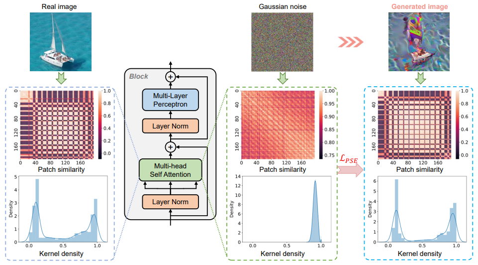

<div align=center>
  
  </div>

# Patch Similarity Aware Data-Free Quantization for Vision Transformers

This repository contains the official PyTorch implementation for the ECCV 2022 paper
*["Patch Similarity Aware Data-Free Quantization for Vision Transformers"](https://arxiv.org/abs/2203.02250).* To the best of our knowledge, this is the first work on data-free quantization for vision transformers. Below are instructions for reproducing the results.

## Installation

- **To install PSAQ-ViT** and develop locally:
  
  ```bash
  git clone https://github.com/zkkli/PSAQ-ViT.git
  cd PSAQ-ViT
  ```

## Quantization

- You can quantize and evaluate a single model using the following command:

```bash
python test_quant.py [--model] [--dataset] [--w_bit] [--a_bit] [--mode]

optional arguments:
--model: Model architecture, the choises can be: 
         deit_tiny, deit_small, deit_base, swin_tiny, and swin_small.
--dataset: Path to ImageNet dataset.
--w_bit: Bit-precision of weights, default=8.
--a_bit: Bit-precision of activation, default=8.
--mode: Mode of calibration data,
        0: Generated fake data (PSAQ-ViT)
        1: Gaussian noise
        2: Real data
```

- Example: Quantize DeiT-B with generated fake data **(PSAQ-ViT)**.

```bash
python test_quant.py --model deit_base --dataset <YOUR_DATA_DIR> --mode 0
```

- Example: Quantize DeiT-B with Gaussian noise.

```bash
python test_quant.py --model deit_base --dataset <YOUR_DATA_DIR> --mode 1
```

- Example: Quantize DeiT-B with Real data.

```bash
python test_quant.py --model deit_base --dataset <YOUR_DATA_DIR> --mode 2
```

## Results

Below are the experimental results of our proposed PSAQ-ViT that you should get on ImageNet dataset using an RTX 3090 GPU.

| Model          | Prec. | Top-1(%) | Prec. | Top-1(%) |
|:--------------:|:-----:|:--------:|:-----:|:--------:|
| DeiT-T (72.21) | W4/A8 | 65.57    | W8/A8 | 71.56    |
| DeiT-S (79.85) | W4/A8 | 73.23    | W8/A8 | 76.92    |
| DeiT-B (81.85) | W4/A8 | 77.05    | W8/A8 | 79.10    |
| Swin-T (81.35) | W4/A8 | 71.79    | W8/A8 | 75.35    |
| Swin-S (83.20) | W4/A8 | 75.14    | W8/A8 | 76.64    |

## Citation

We appreciate it if you would please cite the following paper if you found the implementation useful for your work:

```bash
@inproceedings{li2022psaqvit,
  title={Patch Similarity Aware Data-Free Quantization for Vision Transformers},
  author={Li, Zhikai and Ma, Liping and Chen, Mengjuan and Xiao, Junrui and Gu, Qingyi},
  booktitle={European Conference on Computer Vision},
  pages={154--170},
  year={2022}
}
```
